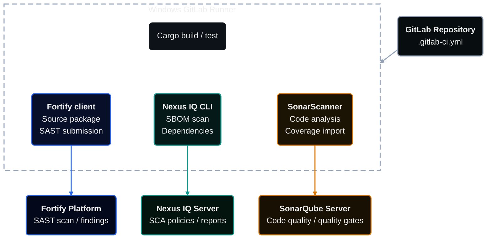

```mermaid
flowchart TB
    repository("<b>GitLab Repository</b><br/>.gitlab-ci.yml")

    subgraph runner["Windows GitLab Runner"]
        direction TB
        cargo("Cargo build / test")
        subgraph clients[" "]
            direction LR
            sonar("<b>SonarScanner</b><br/>Code analysis<br/>Coverage import")
            iq("<b>Nexus IQ CLI</b><br/>SBOM scan<br/>Dependencies")
            fortify("<b>Fortify client</b><br/>Source package<br/>SAST submission")
        end
        cargo ~~~ sonar
        cargo ~~~ iq
        cargo ~~~ fortify
    end

    sonar_server("<b>SonarQube Server</b><br/>Code quality / quality gates")
    iq_server("<b>Nexus IQ Server</b><br/>SCA policies / reports")
    fortify_platform("<b>Fortify Platform</b><br/>SAST scan / findings")

    repository --> runner
    sonar --> sonar_server
    iq --> iq_server
    fortify --> fortify_platform

    style repository fill:#080d10,stroke:#94a3b8,stroke-width:2px,color:#eeeeee
    style runner fill:transparent,stroke:#94a3b8,stroke-width:2px,stroke-dasharray:10 6,color:#eeeeee
    style clients fill:transparent,stroke:transparent
    style cargo fill:#0d1218,stroke:#0d1218,color:#eeeeee
    style sonar fill:#1b1405,stroke:#d97706,stroke-width:2px,color:#eeeeee
    style sonar_server fill:#171003,stroke:#d97706,stroke-width:2px,color:#eeeeee
    style iq fill:#051919,stroke:#0d9488,stroke-width:2px,color:#eeeeee
    style iq_server fill:#03140f,stroke:#0d9488,stroke-width:2px,color:#eeeeee
    style fortify fill:#080f29,stroke:#2563eb,stroke-width:2px,color:#eeeeee
    style fortify_platform fill:#03091b,stroke:#2563eb,stroke-width:2px,color:#eeeeee
    linkStyle 3 stroke:#94a3b8,stroke-width:2px
    linkStyle 4 stroke:#d97706,stroke-width:2px
    linkStyle 5 stroke:#0d9488,stroke-width:2px
    linkStyle 6 stroke:#2563eb,stroke-width:2px
```
